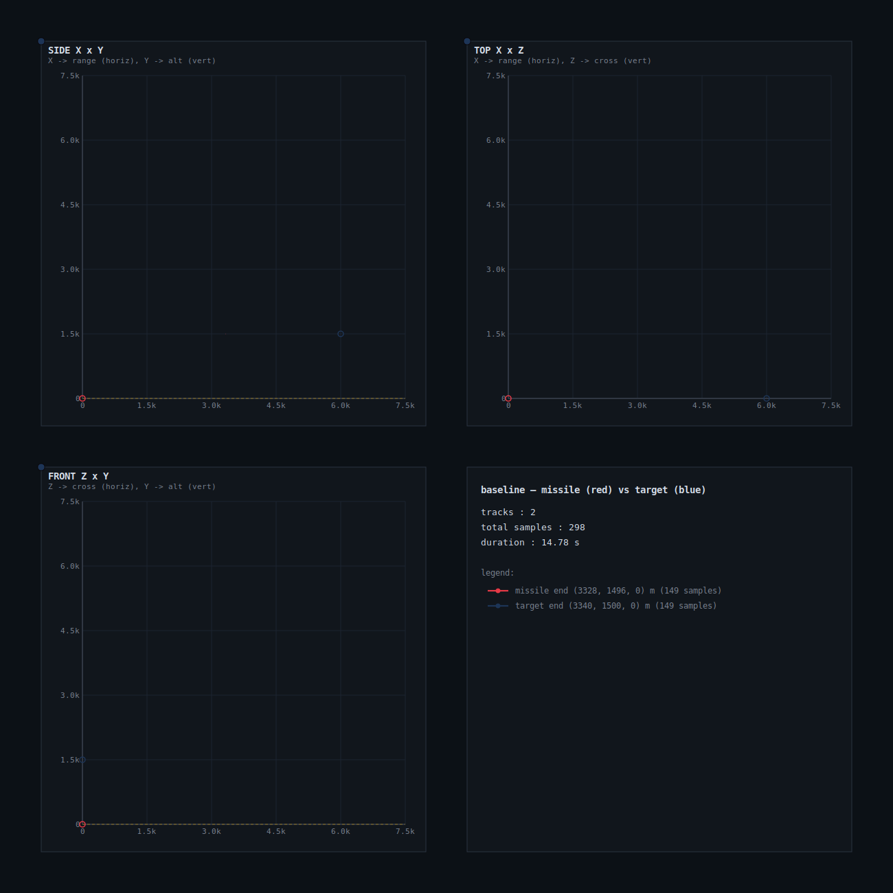
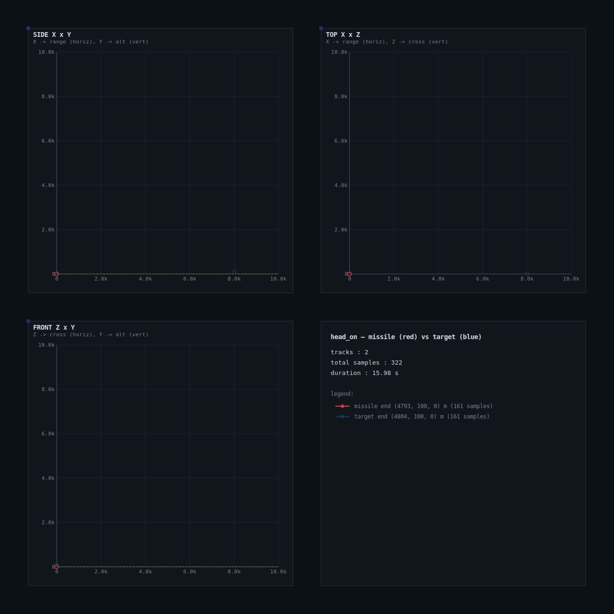
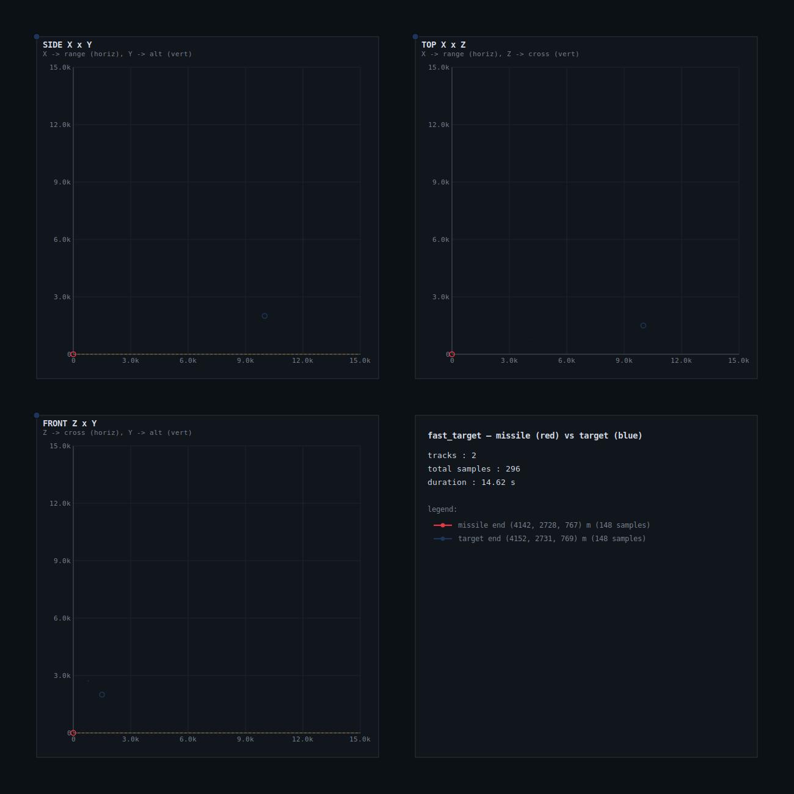

# Deadreckon

Deterministic 3D missile-guidance simulation with proportional navigation.
Built on top of [`physics_sandbox`](https://crates.io/crates/physics_sandbox)
for rigid-body dynamics + RK4 integration; deadreckon adds the seeker, the
guidance law, the engagement bookkeeping, and the Monte Carlo sweep.

## Quick Start

```bash
# Run a single scenario
cargo run -p sim_cli -- baseline
cargo run -p sim_cli -- turning
cargo run -p sim_cli -- weaving

# Run with sensor noise
cargo run -p sim_cli -- baseline --noise=realistic
cargo run -p sim_cli -- turning  --noise=degraded
cargo run -p sim_cli -- weaving  --noise=extreme

# Visualize (3-view ASCII instrument cluster: SIDE / TOP / FRONT)
cargo run -p sim_viz -- turning

# Monte Carlo analysis (500 trials)
cargo run -p sim_cli -- sweep baseline 500
cargo run -p sim_cli -- sweep weaving  500 --nav=1.5
cargo run -p sim_cli -- sweep baseline 500 --noise=realistic
```

## World Conventions

3D, right-handed, Y-up:

| Axis | Meaning           |
| ---- | ----------------- |
| X    | downrange         |
| Y    | altitude          |
| Z    | cross-range       |

Units: meters, seconds, kilograms, radians.

## Sensor Noise Levels

| Level       | Range σ | Range Rate σ | Bearing σ | LOS Rate σ   |
| ----------- | ------- | ------------ | --------- | ------------ |
| `perfect`   | 0       | 0            | 0         | 0            |
| `realistic` | 10 m    | 2 m/s        | 0.002 rad | 0.001 rad/s  |
| `degraded`  | 50 m    | 10 m/s       | 0.01 rad  | 0.005 rad/s  |
| `extreme`   | 800 m   | 150 m/s      | 0.2 rad   | 0.1 rad/s    |

Bearing σ is applied as a small perpendicular kick to the LOS unit vector
followed by re-normalization. LOS rate σ is per-component on the rate vector.

## Scenarios

| Name          | Description                                              | Preview |
| ------------- | -------------------------------------------------------- | ------- |
| `baseline`    | Standard engagement, target approaching                  | [SVG](docs/svg/baseline.svg) |
| `head_on`     | Target flying directly at missile                        | [SVG](docs/svg/head_on.svg) |
| `crossing`    | Target moving cross-range (Z), out-of-plane intercept    | [SVG](docs/svg/crossing.svg) |
| `fast_target` | Supersonic target with cross-range + altitude offset     | [SVG](docs/svg/fast_target.svg) |
| `turning`     | Target executing a steady yaw-axis turn                  | [SVG](docs/svg/turning.svg) |
| `weaving`     | Target weaving sinusoidally around the up axis (~15 g)   | [SVG](docs/svg/weaving.svg) |

### Animated trajectories

Missile (red) intercepting the target (blue) in each scenario. SMIL-animated
SVG — click through for the looping animation; GitHub renders the static
frame inline. Regenerate with `cargo run -p sim_viz --bin sim_svg`.

<p align="center">
  
  
  <br/>
  
  
  <br/>
  
  
</p>

## Workspace

| Crate      | Purpose                                                       |
| ---------- | ------------------------------------------------------------- |
| `sim_core` | Guidance, seeker, scenarios, Monte Carlo (uses physics_sandbox) |
| `sim_cli`  | Command-line runner                                           |
| `sim_viz`  | Terminal 3-view visualization (`sim_viz`) + headless animated SVG exporter (`sim_svg`) |
