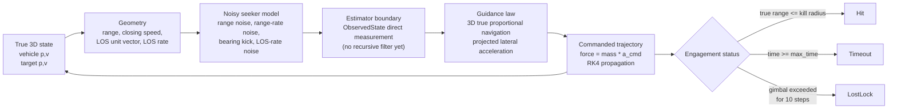

# Deadreckon

Deadreckon is a compact Rust simulation portfolio project: deterministic 3D dynamics, noisy sensing, proportional-navigation guidance, Monte Carlo runs, and SVG/terminal visualization in a small workspace. It is built to show systems judgment--clear math, reproducible scenarios, bounded assumptions, and testable simulation code--rather than production weapon software.

Deadreckon is a deterministic 3D guided-flight intercept simulator for exploring the same feedback loop that shows up in flight software and avionics: estimate relative state from imperfect measurements, turn that estimate into a guidance command, and verify whether the commanded trajectory closes range. The current implementation keeps the estimator simple on purpose--it uses the latest noisy seeker observation directly--so the guidance, sensing, and engagement bookkeeping are easy to inspect before adding heavier state estimation such as an EKF.

## How it works

The simulator is a Rust workspace with a reusable core crate, a CLI runner, and terminal/SVG visualization binaries. The physics state is advanced by `physics_sandbox` with an RK4 integrator in a no-gravity, no-atmosphere environment; `deadreckon` adds target maneuvers, seeker noise, 3D proportional navigation, acceleration limiting, gimbal lock checks, hit/timeout logic, and Monte Carlo sweeps.



## Implemented model

World axes are right-handed: `X` is downrange, `Y` is altitude/up, and `Z` is cross-range. Units are meters, seconds, kilograms, and radians.

| Crate | Role |
| --- | --- |
| `sim_core` | State types, scenarios, seeker model, guidance law, target maneuvers, telemetry, Monte Carlo |
| `sim_cli` | Command-line scenario runner and Monte Carlo runner |
| `sim_viz` | Terminal three-view visualization and headless SVG trajectory exporter |

### State and dynamics

The core state is the missile and target position/velocity:

$$
x_m = (p_m, v_m), \qquad x_t = (p_t, v_t)
$$

The simulation environment is `Environment::space()`, so gravity and atmosphere are disabled. Forces are applied to rigid bodies and integrated by `physics_sandbox`'s RK4 integrator:

$$
\dot{p} = v, \qquad \dot{v} = \frac{F}{m}
$$

$$
x_{k+1} = \mathrm{RK4}(x_k, f(x_k, F_k), \Delta t)
$$

For the missile, the only modeled force is the lateral guidance command:

$$
F_m = m_m a_{cmd}
$$

Target maneuver modes implemented in `sim_core` are:

| Mode | Code behavior |
| --- | --- |
| `ConstantVelocity` | No force or velocity override is applied. |
| `ConstantTurn` | Target velocity is rotated every step with Rodrigues' formula. |
| `AccelBurst` | A constant acceleration force is applied between `start_t` and `end_t`. |
| `Weave` | A sinusoidal acceleration is applied perpendicular to target velocity. |

For constant turns, the velocity update is:

$$
v' = v\cos\theta + (k \times v)\sin\theta + k(k \cdot v)(1 - \cos\theta),
\qquad \theta = \omega \Delta t
$$

For weave maneuvers, the applied acceleration magnitude is:

$$
a(t) = A\sin(2\pi f t)
$$

directed along the component of the configured maneuver axis that is perpendicular to the current target velocity.

### Relative geometry

Each guidance step derives true relative geometry from missile and target state:

$$
r = p_t - p_m, \qquad R = \max(\lVert r\rVert, 10^{-6}), \qquad \hat{r} = \frac{r}{R}
$$

$$
v_{rel} = v_t - v_m, \qquad V_c = -v_{rel}\cdot\hat{r}
$$

$$
\omega_{LOS} = \frac{r \times v_{rel}}{R^2}
$$

`V_c` is the closing speed and `omega_LOS` is the 3D line-of-sight rate vector in world coordinates.

### Sensor model

The seeker model converts true geometry into `ObservedState`. There is not yet a Kalman filter or smoother; the guidance law consumes this current noisy observation directly.

Range and closing speed receive scalar Gaussian white noise:

$$
R_{obs} = \max(R + \epsilon_R, 1), \qquad \epsilon_R \sim \mathcal{N}(0, \sigma_R^2)
$$

$$
V_{c,obs} = V_c + \epsilon_V, \qquad \epsilon_V \sim \mathcal{N}(0, \sigma_V^2)
$$

Bearing noise is applied as a random perpendicular kick before renormalizing. If `b_1` and `b_2` are orthonormal basis vectors perpendicular to the true line of sight:

$$
\hat{r}_{obs} =
\frac{\hat{r} + b_1\epsilon_{\theta 1} + b_2\epsilon_{\theta 2}}
{\left\lVert \hat{r} + b_1\epsilon_{\theta 1} + b_2\epsilon_{\theta 2}\right\rVert},
\qquad
\epsilon_{\theta i} \sim \mathcal{N}(0, \sigma_\theta^2)
$$

LOS-rate noise is added independently to each vector component:

$$
\omega_{obs} = \omega_{LOS} + \epsilon_\omega,
\qquad
\epsilon_{\omega,x}, \epsilon_{\omega,y}, \epsilon_{\omega,z}
\sim \mathcal{N}(0, \sigma_\omega^2)
$$

Built-in noise presets:

| Level | Range sigma | Range-rate sigma | Bearing sigma | LOS-rate sigma |
| --- | ---: | ---: | ---: | ---: |
| `perfect` | 0 m | 0 m/s | 0 rad | 0 rad/s |
| `realistic` | 10 m | 2 m/s | 0.002 rad | 0.001 rad/s |
| `degraded` | 50 m | 10 m/s | 0.01 rad | 0.005 rad/s |
| `extreme` | 800 m | 150 m/s | 0.2 rad | 0.1 rad/s |

### Guidance law

The missile uses 3D true proportional navigation with navigation constant `N = params.nav_const`. First, the seeker checks look angle against the missile gimbal limit:

$$
\alpha = \cos^{-1}\left(\mathrm{clamp}(\hat{v}_m \cdot \hat{r}_{obs}, -1, 1)\right)
$$

If the look angle exceeds `gimbal_limit` for 10 consecutive steps, the engagement returns `LostLock`. Otherwise, the raw PN acceleration is:

$$
a_{raw} = N V_{c,obs}(\omega_{obs} \times \hat{r}_{obs})
$$

The code then removes any component along the missile velocity so the command is lateral only:

$$
\hat{v}_m = \frac{v_m}{\lVert v_m\rVert}, \qquad
a_\perp = a_{raw} - \hat{v}_m(a_{raw}\cdot\hat{v}_m)
$$

Finally, the command is magnitude-limited by `missile.a_max`:

$$
a_{cmd} =
\begin{cases}
a_\perp \frac{\min(\lVert a_\perp\rVert, a_{max})}{\lVert a_\perp\rVert}, & \lVert a_\perp\rVert > 10^{-9} \\
0, & \text{otherwise}
\end{cases}
$$

### Interception logic

Hit detection uses true geometry, not noisy measurements:

$$
\lVert p_t - p_m\rVert \le r_{kill}
$$

The check runs before and after each integration step. If the condition is met, the status is `Hit`; if simulation time reaches `max_time`, the status is `Timeout`; if the seeker remains outside gimbal limits for the persistence window, the status is `LostLock`.

## Scenarios

| Name | Implemented target behavior |
| --- | --- |
| `baseline` | Offset target approaching at constant velocity |
| `head_on` | Same-altitude head-on constant-velocity target |
| `crossing` | Constant-velocity target crossing in `Z` |
| `fast_target` | Faster constant-velocity target with altitude and cross-range offset |
| `turning` | Constant-turn target around the world `Y` axis |
| `weaving` | Sinusoidal lateral weave around the world `Y` axis |

The repository includes generated SVG previews in `docs/svg/`. Regenerate them with:

```bash
cargo run -q -p sim_viz --bin sim_svg
```

<p align="center">
  
  
  <br/>
  
  
  <br/>
  
  
</p>

## Run it

Run the test suite:

```bash
cargo test --workspace
```

Run a deterministic single engagement:

```bash
cargo run -q -p sim_cli -- baseline
```

Expected output:

```text
=== Scenario: baseline (3D, perfect) ===
status: Hit
t: 14.78s  range: 12.18m  closing: 413.52m/s  los_rate: 0.000000rad/s  a_cmd: 0.00m/s^2
missile.p: (3328.1, 1496.1, 0.0)  v: (211.3, 133.9, 0.0)
target.p:  (3339.6, 1500.0, 0.0)  v: (-180.0, 0.0, 0.0)
```

Run the example script, which performs the same baseline engagement plus a 10-trial Monte Carlo smoke test:

```bash
bash scripts/example_run.sh
```

Expected output:

```text
=== Scenario: baseline (3D, perfect) ===
status: Hit
t: 14.78s  range: 12.18m  closing: 413.52m/s  los_rate: 0.000000rad/s  a_cmd: 0.00m/s^2
missile.p: (3328.1, 1496.1, 0.0)  v: (211.3, 133.9, 0.0)
target.p:  (3339.6, 1500.0, 0.0)  v: (-180.0, 0.0, 0.0)

--- Monte Carlo smoke test (10 trials) ---
=== Monte Carlo: baseline (3D, 10 trials) ===

╔═══════════════════════════════════════╗
║       MONTE CARLO RESULTS             ║
╠═══════════════════════════════════════╣
║ Trials:         10                    ║
║ Hits:           10                    ║
║ Hit Rate:    100.0%                   ║
╠═══════════════════════════════════════╣
║ Miss Distance Statistics (m)          ║
║   Mean:        10.46                  ║
║   Std:          2.38                  ║
║   Min:          7.39                  ║
║   Max:         14.51                  ║
║   P50:         10.68                  ║
║   P90:         13.77                  ║
║   P99:         14.51                  ║
╚═══════════════════════════════════════╝

Miss Distance Distribution:
   Range    Count
   7-8        2 │████████████████████████████████████████
   8-9        1 │████████████████████
   9-9        2 │████████████████████████████████████████
   9-10       0 │
  10-10       0 │
  10-11       1 │████████████████████
  11-12       0 │
  12-12       1 │████████████████████
  12-13       1 │████████████████████
  13-13       0 │
  13-14       1 │████████████████████
  14-15       1 │████████████████████
```

Other useful commands:

```bash
cargo run -q -p sim_cli -- turning --noise=realistic
cargo run -q -p sim_cli -- sweep baseline 500 --seed=42 --noise=realistic
cargo run -q -p sim_viz -- weaving
cargo run -q -p sim_viz --bin sim_svg baseline
```

## Roadmap

These are aspirational next steps, not implemented features:

1. Add an extended Kalman filter or alpha-beta filter between the noisy seeker and PN guidance.
2. Model missile thrust, drag, gravity, and actuator response instead of lateral acceleration only.
3. Add richer 3D target maneuvers, multiple simultaneous targets, and target selection logic.
4. Add guidance-law comparisons such as augmented PN or pure pursuit.
5. Export machine-readable telemetry for plotting, regression analysis, and hardware-in-the-loop style replay.

## License

MIT
